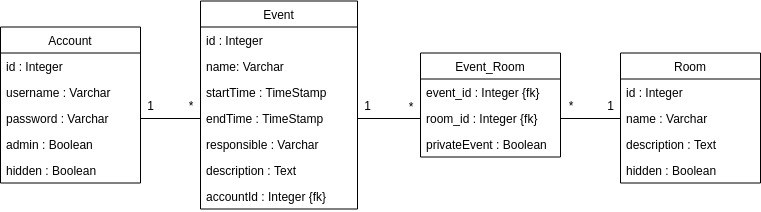

# Varauskalenterin dokumentaatio

Varauskalenterin backend on paljolti osaksi valmis. Frontti sen sijaan on vielä varsin karu ja ruma, lisäksi järjestelmä ei vielä ole kovin informatiivinen esimerkiksi onnistuneista tapahtumista tai virheistä.

## Sovelluksen logiikka

Sovelluksen on tarkoitus palvella Helsingin yliopiston matemaattis-luonnontieteellisen ainejärjestö Matlun varauskalenterina jäsenjärjestöille. Jäsenjärjestöt voivat varata niin sanotun Klusterin eri tiloja käyttöönsä. Kirjautumattomalle henkilölle varauskalenteri on avoin, mutta tapahtuman luomiseen ja varaamiseen järjestön täytyy kirjautua sisään. Matlu hallinnoi tunnuksia ja varattavia huoneita.

Kun tapahtuma luodaan järjestelmään, järjestelmä tarkistaa ettei mikään muu tapahtuma ole jo varannut joitain haluttuja alueita. Mikäli näin on käynyt, tapahtumanluonti estetään. Jos tilat ovat kuitenkin vapaina, varaus tapahtuu ja ilmestyy varauskalenteriin. Varauksia voi tehdä vain tulevaisuuteen ja korkeintaan vuoden päähän.

## Tietokanta

Tietokanta koostuu neljästä taulusta. Account-taulu sisältää käyttäjät, kukin käyttäjä voi lisätä Event-tauluun tapahtumia, jotka liitostaulun kautta voivat varata useampia huoneita.

### Account

Account-taulua käytetään tietysti kirjautumiseen, mutta henkilön ID tallennetaan myös hänen luomiin tapahtumiin. Käyttäjiä ei ole tarkoitus varsinaisesti poistaa ikinä, vaan käyttäjän voi poistaa käytöstä Hidden-sarakkeen avulla. Taulussa on myös admin-sarake, mutta sitä ei loppujen lopuksi hyödynnettykään: admin-niminen käyttäjä saa admin-statuksensa usernamesta, eikä useampi admin-käyttäjä ollut loppujen lopuksi tarpeellinen tässä projektissa. Joka tapauksessa puolivalmis tuki sille löytyy, ja siitä voi olla hyötyä joissain erilaisissa käyttökohteissa: kalenteri kuitenkin taipuu aika moneen tarkoitukseen.

### Event

Tämä taulu tallentaa tapahtuman tietoja, ja tapahtuman luonnin yhteydessä myös luojan ID:n.

### Room

Huonetaulu sisältää huoneet tai tilat joita varauskalenterin kautta on tarkoitus valita. Myös tässä taulussa on hidden-attribuutti, mutta sitä ei olla otettu vielä käyttöön.

### Event_Room

Event_Room yhdistää tapahtumat ja huoneet. Kun tapahtuma luodaan, kaikille varatuille huoneille luodaan tähän tauluun uusi rivi.

## Roolit ja käyttötapaukset

Järjestelmässä ei ole muita rooleja kuin admin, rekisteröity käyttäjä sekä rekisteröimätön käyttäjä.

* Varauskalenteri on kaikille julkinen ja sitä voi tarkastella ilman kirjautumista
* Rekisteröity käyttäjä voi lisätä tapahtumia sekä poistaa ja muokata omia tapahtumiaan
* Admin-käyttäjä voi lisätä, poistaa ja muokata tapahtumia, käyttäjiä sekä huoneita.

Käytännössä käyttäjiä ja huoneita ei tässä käyttötapauksessa tule lisää, mutta on mukavaa ettei niitä silti tarvitse tehdä kantaa ronklaamalla.

## TODO-list

* Parempi GUI:
    * Järkevämpi varauskalenterin tarkastelu (kts. Matlun nykyinen varauskalenteri)
        * Lisää filttereitä, esim listauksessa oletuksena vain tulevaisuudessa tapahtuvat tapahtumat
        * Taulu jossa kuukausinäkymä voisi olla järkevämpi, kuten nykyisessä kalenterissa
    * Linkkien piilotus silloin kun oikeuksia ei ole
    * Vähemmän turhauttava ohjaus ja käyttö (esimerkiksi tapahtuman luonti voisi palata suoraan listaukseen jne)
* Huoneiden oikea poisto?
